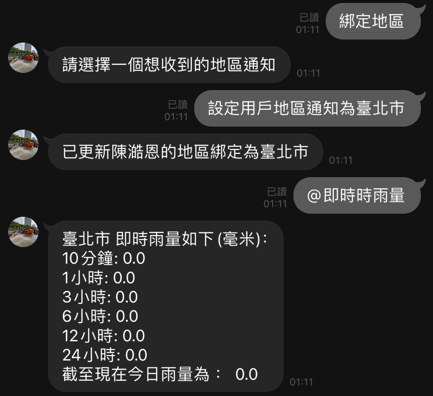

# 災害天氣預報 ｜ 問答小幫手

資訊管理課程專案，目標幫助人們進行洪災防範與預警

### 功能：
- Line機器人預警
- 連接氣象局API
- 試算數值是否達警戒值
- 綁定地區播報
- 查詢即時觀測數據
- chatGPT問答功能

## 操作圖集

## Contributor

>資管三甲
- 10944134 [陳澔恩](https://github.com/hank1224)
- 10944128 [姜智森](https://github.com/Jiangzhisen)

